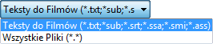
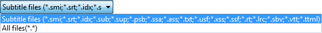
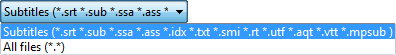
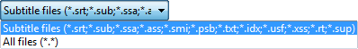
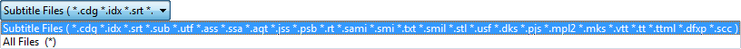

# :play_or_pause_button: Media Player & Subtitle

In this section, we have do some little research to find popular **Media Player** and its abillity to handle subtitle. This is not about which is the best player to handle subtitle but **are they can do that** or supported that, whether its fully or partial.

The popular player we got here are some is still actively developed and some isn't (less active) or deprecated but still can do and perform its great function.

##  ALLPlayer [:link:](https://www.allplayer.org)

> Wikipedia article goes here

> Official sites article goes here

##  GOM Player [:link:](https://www.gomlab.com/gomplayer-media-player)

> Wikipedia article goes here

> Official sites article goes here

We don't have enough information about supported subtitle formats for GOM Player.

##  PotPlayer [:link:](https://daumpotplayer.com)

> Wikipedia article goes here

> Official sites article goes here

##  RealPlayer [:link:](https://www.real.com)

> Wikipedia article goes here

> Official sites article goes here

RealPlayer is a little troublesome when I try to test it.

##  SMPlayer [:link:](https://www.smplayer.info)

> Wikipedia article goes here

> Official sites article goes here

SMPlayer have some issue with playlist in mine. Use VLC instead, its better and more rich features and supported formats.

##  Media Player Classic Home Cinema (MPC-HC) [:link:](https://mpc-hc.org)

> Wikipedia article goes here

> Official sites article goes here

MPC is deprecated since 2017, and the [repository](https://github.com/mpc-hc/mpc-hc) itself also has been archived and read-only for now. But the player itself is still great as a media player.

##  Kodi [:link:](https://kodi.tv)

> Wikipedia article goes here

> Official sites article goes here

I need to research more about this

##  VLC Media Player [:link:](https://www.videolan.org)

> Wikipedia article goes here

> Official sites article goes here

##  KMPlayer [:link:](https://www.kmplayer.com)

> Wikipedia article goes here

> Official sites article goes here

KMPlayer is a fork of MPC (PC, libVLC &rightarrow; Android, mobileVLCkit &rightarrow; iOS), so it doesn't change a lot of the features.

---

## Conclusion

After seeing that, the supported subtitle format from the popular **Media Player** we got are described as table below:

Player | `aqt` | `ass` | `cdg` | `dfxp` | `dks` | `idx` | `jss` | `lrc` | `mks` | `mpl2` | `mpsub` | `pjs` | `psb` | `rt` | `sbv` | `scc` | `smi` | `smil` | `srt` | `ssa` | `ssf` | `stl` | `sub` | `sup` | `ttml` | `txt` | `usf` | `utf` | `vtt` | `xss`
:- | :-: | :-: | :-: | :-: | :-: | :-: | :-: | :-: | :-: | :-: | :-: | :-: | :-: | :-: | :-: | :-: | :-: | :-: | :-: | :-: | :-: | :-: | :-: | :-: | :-: | :-: | :-: | :-: | :-: | :-:
ALLPlayer |  | :heavy_check_mark: |  |  |  |  |  |  |  |  |  |  |  |  |  |  | :heavy_check_mark: |  | :heavy_check_mark: | :heavy_check_mark: |  |  | :heavy_check_mark: |  |  | :heavy_check_mark: |  |  |  |  |
GOM Player |  |  |  |  |  |  |  |  |  |  |  |  |  |  |  |  |  |  |  |  |  |  |  |  |  |  |  |  |  |  |
Potplayer |  | :heavy_check_mark: |  |  |  | :heavy_check_mark: |  | :heavy_check_mark: |  |  |  |  | :heavy_check_mark: | :heavy_check_mark: | :heavy_check_mark: |  | :heavy_check_mark: |  | :heavy_check_mark: | :heavy_check_mark: | :heavy_check_mark: |  | :heavy_check_mark: | :heavy_check_mark: | :heavy_check_mark: | :heavy_check_mark: | :heavy_check_mark: |  | :heavy_check_mark: | :heavy_check_mark: |
RealPlayer |  |  |  |  |  |  |  |  |  |  |  |  |  |  |  |  |  |  |  |  |  |  |  |  |  |  |  |  |  |  |
SMPlayer | :heavy_check_mark: | :heavy_check_mark: |  |  |  | :heavy_check_mark: |  |  |  |  | :heavy_check_mark: |  |  | :heavy_check_mark: |  |  | :heavy_check_mark: |  | :heavy_check_mark: | :heavy_check_mark: |  |  | :heavy_check_mark: |  |  | :heavy_check_mark: |  | :heavy_check_mark: | :heavy_check_mark: |  |
MPC-HC |  | :heavy_check_mark: |  |  |  | :heavy_check_mark: |  |  |  |  |  |  | :heavy_check_mark: | :heavy_check_mark: |  |  | :heavy_check_mark: |  | :heavy_check_mark: | :heavy_check_mark: |  |  | :heavy_check_mark: | :heavy_check_mark: |  | :heavy_check_mark: | :heavy_check_mark: |  |  | :heavy_check_mark: |
Kodi |  |  |  |  |  |  |  |  |  |  |  |  |  |  |  |  |  |  |  |  |  |  |  |  |  |  |  |  |  |  |
VLC | :heavy_check_mark: | :heavy_check_mark: | :heavy_check_mark: | :heavy_check_mark: | :heavy_check_mark: | :heavy_check_mark: | :heavy_check_mark: | :heavy_check_mark: | :heavy_check_mark: | :heavy_check_mark: |  | :heavy_check_mark: | :heavy_check_mark: | :heavy_check_mark: | :heavy_check_mark: | :heavy_check_mark: | :heavy_check_mark: | :heavy_check_mark: | :heavy_check_mark: | :heavy_check_mark: | :heavy_check_mark: | :heavy_check_mark: | :heavy_check_mark: | :heavy_check_mark: | :heavy_check_mark: | :heavy_check_mark: | :heavy_check_mark: | :heavy_check_mark: | :heavy_check_mark: | :heavy_check_mark: |
KMPlayer |  | :heavy_check_mark: |  |  |  | :heavy_check_mark: |  |  |  |  |  |  | :heavy_check_mark: | :heavy_check_mark: |  |  | :heavy_check_mark: |  | :heavy_check_mark: | :heavy_check_mark: |  |  | :heavy_check_mark: | :heavy_check_mark: |  | :heavy_check_mark: | :heavy_check_mark: |  |  | :heavy_check_mark: |
FFmpeg |  |  |  |  |  |  |  |  |  |  |  |  |  |  |  |  |  |  |  |  |  |  |  |  |  |  |  |  |  |  |
Score | 2 | 6 | 1 | 1 | 1 | 5 | 1 | 2 | 1 | 1 | 1 | 1 | 4 | 5 | 2 | 1 | 6 | 1 | 6 | 6 | 2 | 1 | 6 | 4 | 2 | 6 | 4 | 2 | 3 | 4 |

### Formats Support Tier list

Tier | List
:-: | :-
S | `ass`, `ssa`, `smi`, `srt`, `sub`, `txt`
A | `idx`, `rt`
B | `psb`, `sup`, `usf`, `xss`
C | `vtt`
D | `aqt`, `lrc`, `sbv`, `ssf`, `ttml`, `utf`
